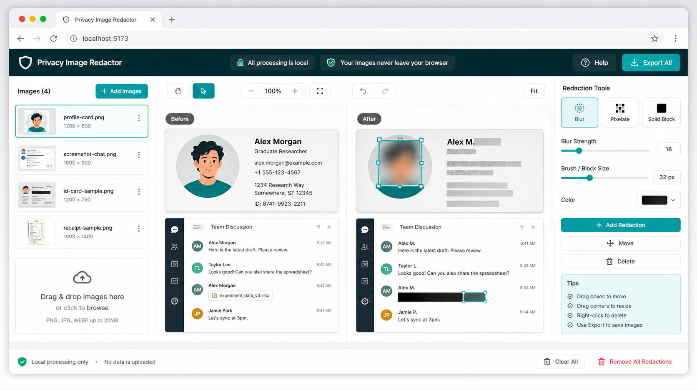

# Privacy Image Redactor

Local-first browser tool for redacting faces, screenshots, and private image regions before publishing public materials.

Images stay in your browser. Redact faces, names, contacts, account IDs, screenshots, and typical image metadata before sharing.

**Live demo:** https://yunyoumao.github.io/privacy-image-redactor/



The showcase image is generated from a synthetic UI prompt. The editable SVG fixtures in `examples/before` and `examples/after` remain the reproducible sample inputs used by the app.

## Features

- Multi-image drag and drop.
- Manual redaction boxes for faces, names, IDs, screenshots, and custom regions.
- Redaction modes: blur, pixelate, and solid block.
- Browser-native `FaceDetector` support when available.
- Single-image PNG download.
- Batch ZIP export.
- Canvas-based export so typical original EXIF metadata is not copied.
- Synthetic examples only.

## Quick Start

```bash
npm install
npm run dev
```

Open the local Vite URL, load the samples, draw redaction boxes, and export.

## Browser Support

Manual redaction works in modern browsers with Canvas support. Automatic face detection is progressive enhancement only; if the browser does not support `FaceDetector`, the app remains fully usable with manual boxes.

## Privacy Boundary

This tool is designed for public-material hygiene, not forensic erasure certification.

- No upload server is used by the app.
- Exports are rendered as new PNG files from Canvas.
- Review every exported image manually before publishing.
- Do not use real private photos or sensitive documents in bug reports.

See [docs/privacy-boundary.md](docs/privacy-boundary.md) and [docs/demo-assets.md](docs/demo-assets.md).

## Validation

```bash
npm run lint
npm run test
npm run build
python scripts/validate_public_assets.py
```

The validation script checks for accidental local paths, credentials, private workspace files, and obvious personal-data patterns in the public repo.

## Topics

Suggested GitHub topics:

```text
privacy
image-processing
redaction
react
typescript
canvas
vite
local-first
github-pages
```

## Synthetic Demo Fixtures

All demo assets are synthetic. The checked-in SVG files are reproducible fixtures for the app, and the README showcase PNG is an AI-generated mockup for public presentation. They do not depict real people, real meetings, real projects, real documents, or unpublished research materials.
